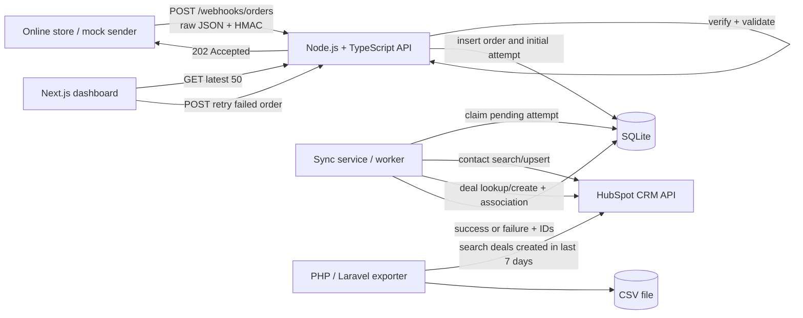
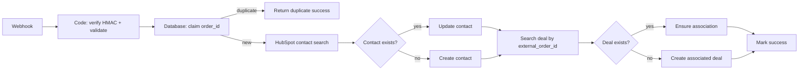

# HubSpot Order Sync: Logic and Requirements Analysis

## Direct assessment

This project is not merely a webhook-to-HubSpot CRUD exercise. Its core requirement is **at-least-once webhook delivery with an exactly-once business effect**: the same valid order may arrive repeatedly, but HubSpot must end with one contact identity, one deal for that order, and a durable history of every real synchronization attempt.

The most grading-safe implementation is:

- **Node.js/TypeScript integration backend:** webhook security, validation, persistence, idempotency, HubSpot synchronization, retry logic, and dashboard API.
- **Next.js/React/TypeScript frontend:** recent attempts and manual retry.
- **PHP/Laravel Artisan command:** seven-day HubSpot deal export to CSV as Language B.
- **SQLite:** `orders` and `sync_attempts` tables, with a database uniqueness constraint on `orders.order_id`.

A previously considered hybrid—Node.js only for ingress and Laravel for requirements 23–27—is technically defensible because the brief explicitly fixes Node.js/TypeScript only for requirement 22. However, it introduces an unnecessary service boundary, internal authentication, cross-service failure handling, and deployment work. For a project expected to take 4–6 hours, keeping requirements 22–27 in one Node.js service is simpler, easier to demonstrate, and less risky.

## Requirement interpretation

| Requirement | Actual behavior required | Evidence the reviewer should see | Common failure |
|---|---|---|---|
| 22. Webhook receiver | Accept the order event, preserve the raw body, verify HMAC, parse JSON, and validate all required fields and types | Invalid signature returns `401`; invalid payload returns `400` or `422`; valid payload is accepted | Calculating the signature from re-serialized JSON instead of the exact received bytes |
| 23. HubSpot sync | Find contact by email, update it if found or create it otherwise, then create one associated deal | HubSpot contact and deal IDs are stored locally; the deal visibly links to the contact | Always creating contacts; creating a deal without its contact association |
| 24. Idempotency | Repeated `order_id` values must converge on the same deal | Database `UNIQUE`/primary-key protection plus a HubSpot external order property | An in-memory `Set`, which fails after restart or under concurrent requests |
| 25. Reliability | Retry only transient failures such as `429`, `5xx`, timeouts, and connection failures; record terminal failure | Backoff code, attempt count, stored error, and a reproducible failed state | Retrying every `4xx`, including invalid credentials and malformed requests |
| 26. Storage | Preserve each real processing attempt, its status, IDs, error, and timestamps | Database migration/schema and rows for initial processing and manual retries | One mutable order row that overwrites earlier failures and loses attempt history |
| 27. Dashboard | Display the most recent 50 attempts and permit retry of failed attempts | Table with status and error; retry action creates another attempt | A retry button that directly creates another HubSpot deal without idempotency checks |
| 28. Language B | An independently runnable Python, PHP, or C# script exports HubSpot deals from the preceding seven days | Command invocation, pagination, CSV output, and error behavior documented | Exporting only the first API page or reading the local database instead of HubSpot |
| 29. README | Make the repository reproducible and explain important decisions | Setup, environment variables, architecture, commands, assumptions, tests, and future improvements | A generic README without HubSpot property and pipeline setup |

## Recommended architecture



This design needs no Redis for the assessment. SQLite acts as the durable source of truth, while a small worker loop in the Node.js process claims pending attempts. The worker can also be replaced by immediate in-process execution after persistence, but the order and attempt must be committed before synchronization begins.

The HubSpot object model supports creating deals with properties and associations, including an association to an existing contact. Contact records can be looked up using email, while other property-based queries can use the search API.[^1][^2][^3]

## End-to-end sequence

```mermaid
sequenceDiagram
    autonumber
    participant S as Store / mock sender
    participant N as Node API
    participant D as SQLite
    participant H as HubSpot
    participant U as Dashboard user

    S->>N: POST /webhooks/orders + HMAC + raw JSON
    N->>N: Verify HMAC against raw bytes
    alt Signature missing or invalid
        N-->>S: 401 Unauthorized
    else Signature valid
        N->>N: Parse and validate schema
        alt Payload invalid
            N-->>S: 422 Unprocessable Entity
        else Payload valid
            N->>D: INSERT order with UNIQUE(order_id)
            alt New order
                N->>D: INSERT sync_attempt(status=pending)
                N-->>S: 202 Accepted
                N->>D: Atomically claim pending attempt
                N->>H: Find contact by email
                alt Contact exists
                    N->>H: Update contact fields
                else Contact absent
                    N->>H: Create contact
                end
                N->>H: Find deal by external_order_id
                alt Deal already exists
                    N->>H: Ensure contact association
                else Deal absent
                    N->>H: Create deal with contact association
                end
                N->>D: Mark attempt succeeded; save IDs
                N->>D: Mark order synced; save canonical IDs
            else Duplicate order_id
                N->>D: Read canonical order result
                N-->>S: 200 OK, duplicate=true, existing state/IDs
            end
        end
    end

    U->>N: POST /api/orders/{order_id}/retry
    N->>D: Verify latest state is failed; INSERT new pending attempt
    N-->>U: 202 Accepted
```

The duplicate path must not enqueue an unrestricted second synchronization. It should return the known state or IDs. If the existing order is still `pending` or `processing`, the response says it is already in progress; if it is `succeeded`, the response returns the existing IDs; if it is `failed`, the dashboard retry endpoint—not an accidental webhook duplicate—starts a deliberate new attempt.

## Webhook security contract

The brief does not define the header name, digest encoding, or exact string to sign. These are therefore explicit project assumptions and must be implemented identically in the receiver and mock sender:

```text
Header: X-Webhook-Signature
Algorithm: HMAC-SHA256
Input: exact raw HTTP request-body bytes
Encoding: lowercase hexadecimal
Secret: WEBHOOK_SECRET
```

Conceptual verification:

```ts
const expected = createHmac('sha256', env.WEBHOOK_SECRET)
  .update(rawBody)
  .digest();

const received = Buffer.from(signatureHeader, 'hex');
const valid = received.length === expected.length &&
  timingSafeEqual(received, expected);
```

Node's `createHmac()` produces the HMAC, and `timingSafeEqual()` performs a constant-time comparison of equal-length buffers; differing lengths must be rejected before calling it. Verification must run against the raw body **before** JSON parsing because whitespace or key-order changes can produce different bytes even when the parsed object is equivalent.[^4]

Recommended response contract:

| Condition | HTTP response | Persisted? |
|---|---:|---|
| Missing/invalid signature | `401` | No |
| Valid signature, malformed JSON | `400` | No |
| Valid JSON, schema violation | `422` | Optional rejection log, but not a sync attempt |
| New valid order persisted | `202` | Order plus pending attempt |
| Duplicate order already known | `200` | No new sync attempt |
| Storage unavailable before acceptance | `503` | No; sender may retry |

A timestamp header and freshness window would improve replay protection, but the assignment only explicitly demands HMAC and order-level idempotency. It should be listed under “with more time,” unless the mock sender is updated to sign a documented timestamp together with the raw body.

## Payload validation

Validation should reject the event unless all of the following are true:

- `event` is exactly `order.created`.
- `order_id` is a non-empty bounded string; for example, 1–100 characters.
- `created_at` is a valid ISO 8601 timestamp with an offset.
- `customer.email` is a syntactically valid email address.
- `first_name` and `last_name` are non-empty strings.
- `phone` is a string; E.164 validation may be applied if documented.
- `items` contains at least one item.
- Every item has non-empty `sku` and `name`, integer `qty > 0`, and numeric `price >= 0`.
- `currency` is a three-letter uppercase code such as `PHP`.
- `total` is numeric and non-negative.

For financial values, avoid binary-floating-point equality. Parse prices into minor units—centavos for PHP—and verify:

```text
computed_total_minor = sum(qty × rounded_item_price_minor)
provided_total_minor = rounded(total × 100)
```

Reject the payload if those integer values differ. This catches a corrupted or inconsistent order before HubSpot receives an incorrect amount. If discounts, taxes, or shipping will later be added, this validation must be revised because the sample schema currently has no such fields.

## Idempotency design

Idempotency must exist at two layers because either layer alone has a failure window.

### Local database guard

```sql
CREATE TABLE orders (
    order_id TEXT PRIMARY KEY,
    payload_json TEXT NOT NULL,
    status TEXT NOT NULL CHECK (
        status IN ('pending', 'processing', 'succeeded', 'failed')
    ),
    hubspot_contact_id TEXT,
    hubspot_deal_id TEXT,
    created_at TEXT NOT NULL,
    updated_at TEXT NOT NULL
);
```

The primary key makes `order_id` insertion atomic even when duplicate requests arrive concurrently. SQLite defines a uniqueness constraint through `UNIQUE`, `PRIMARY KEY`, or a unique index. The code must handle the constraint conflict by reading the existing row; it must not perform a vulnerable “SELECT, then INSERT” without relying on the database constraint.[^5]

### HubSpot guard

Create a deal property named `external_order_id` and configure it as a unique identifier. HubSpot supports custom unique identifier properties, and those identifiers can be used to retrieve and update records in the same way as the default object ID.[^6][^7]

Every synchronization performs this logic before creating a deal:

```text
search deal where external_order_id = order_id
if found:
    treat it as the canonical deal
    ensure it is associated with the contact
    repair the local IDs and mark success
else:
    create deal with external_order_id and contact association
```

This second guard closes the critical crash window:

1. HubSpot successfully creates the deal.
2. The Node.js process crashes before saving the HubSpot deal ID locally.
3. A retry starts later.
4. The retry searches `external_order_id`, finds the existing deal, and does not create another.

A mere local `succeeded` flag cannot protect step 2, because that flag was never written. An in-memory lock is also insufficient because it disappears on restart and does not coordinate multiple application processes.

## Persistence model

Use separate `orders` and `sync_attempts` tables. The order row represents the canonical business operation; attempt rows are append-only execution history.

```sql
CREATE TABLE sync_attempts (
    id INTEGER PRIMARY KEY AUTOINCREMENT,
    order_id TEXT NOT NULL,
    trigger TEXT NOT NULL CHECK (
        trigger IN ('webhook', 'manual_retry')
    ),
    status TEXT NOT NULL CHECK (
        status IN ('pending', 'processing', 'succeeded', 'failed')
    ),
    retry_count INTEGER NOT NULL DEFAULT 0,
    hubspot_contact_id TEXT,
    hubspot_deal_id TEXT,
    error_code TEXT,
    error_message TEXT,
    started_at TEXT,
    finished_at TEXT,
    created_at TEXT NOT NULL,
    FOREIGN KEY (order_id) REFERENCES orders(order_id)
);

CREATE INDEX idx_sync_attempts_recent
    ON sync_attempts(created_at DESC);
```

Do not put `UNIQUE(order_id)` on `sync_attempts`; one order may legitimately have an initial failed attempt and a later successful manual retry. The uniqueness rule belongs on `orders.order_id`, where it prevents multiple canonical operations.

### Attempt state machine

```mermaid
stateDiagram-v2
    [*] --> pending: valid new webhook or manual retry
    pending --> processing: worker atomically claims row
    processing --> succeeded: contact and canonical deal confirmed
    processing --> failed: retries exhausted / permanent error
    failed --> pending: user requests retry; new attempt row
    succeeded --> [*]
```



The transition from `pending` to `processing` should be conditional—for example, update the row only when its current status remains `pending`. This prevents two worker ticks from claiming the same attempt.

## HubSpot mapping

| Source | HubSpot target | Rule |
|---|---|---|
| `customer.email` | Contact `email` | Identity key; search by exact normalized email |
| `customer.first_name` | Contact `firstname` | Update existing or set on create |
| `customer.last_name` | Contact `lastname` | Update existing or set on create |
| `customer.phone` | Contact `phone` | Update existing or set on create |
| `order_id` | Deal `external_order_id` | Custom unique property; idempotency key |
| `order_id` + customer name | Deal `dealname` | Example: `Order ORD-10482 — Maria Santos` |
| `total` | Deal `amount` | Decimal string, e.g. `900.00` |
| `created_at` | Deal `closedate` | Documented assumption: order creation time is the close time |
| Environment/configuration | Deal `pipeline` | Internal HubSpot pipeline ID, not the visible label |
| Environment/configuration | Deal `dealstage` | Internal stage ID belonging to that pipeline |
| `currency` | Optional deal currency property | Include only if the test account and selected API support it; otherwise document that the portal uses PHP |
| `items` | Optional `description` | Human-readable summary; not required for grading |

Deals normally require `dealname`, `dealstage`, and `pipeline` among their key properties, and the deal stage must belong to the chosen pipeline. Retrieve the available stages and use their returned internal IDs rather than copying labels from the UI.[^8][^9][^10]

Create the deal and contact association in one HubSpot request when possible. HubSpot's deal create API accepts associations to existing records. If association creation is a separate call, the retry/recovery path must also check and repair that association.[^2]

### Contact upsert

```text
1. Find contact by email.
2. If found, PATCH firstname, lastname, and phone.
3. If absent, POST a new contact.
4. If creation reports an email conflict caused by a race, retrieve the existing contact and update it.
5. Save the resulting contact ID on the attempt.
```

HubSpot treats contact email as an additional unique identifier, and record IDs should be handled as strings. This makes email the appropriate contact lookup key for the assignment.[^7]

## Retry policy

Retry only errors likely to succeed later:

| Failure | Retry? | Action |
|---|---:|---|
| HTTP `429` | Yes | Honor `Retry-After` when present; otherwise back off |
| HTTP `500`, `502`, `503`, `504` | Yes | Exponential backoff with jitter |
| Network reset, DNS/transient connection error, timeout | Yes | Exponential backoff with jitter |
| HTTP `400` or `422` | No | Mapping/request bug or invalid property; record failure |
| HTTP `401` or `403` | No | Token/scope configuration error; record failure |
| HTTP `404` | Normally no | Wrong endpoint/ID; handle only a specifically understood race |
| Local validation error | No | Reject before synchronization |

HubSpot returns `429` when an integration exceeds its rate limits, and its documentation recommends throttling requests when the rolling limit is reached. HubSpot's error guidance identifies both `429` and `5xx` conditions as retryable classes in its automated execution context.[^11][^12]

A small assessment-friendly policy is:

```text
maximum HubSpot attempts per API operation: 4 total
base delays: 500 ms, 1 s, 2 s
jitter: random 0–250 ms
429: use Retry-After when present
request timeout: 10 s
```

“Four total” means the first request plus at most three retries. Store the final sanitized message and HubSpot correlation ID if available. Do not store the HubSpot token or full authorization headers.

## Dashboard contract

The dashboard should read only the local database; it should not call HubSpot on every page load. HubSpot recommends caching rather than making API requests on every page view.[^11]

### Backend endpoints

| Method | Endpoint | Behavior |
|---|---|---|
| `POST` | `/webhooks/orders` | Raw-body HMAC verification, validation, order acceptance |
| `GET` | `/api/sync-attempts?limit=50` | Return newest 50 attempt rows, joined with order details |
| `POST` | `/api/orders/:orderId/retry` | Permit only when no attempt is pending/processing and the latest outcome failed |
| `GET` | `/health` | Confirm process and database availability; do not expose secrets |

Example dashboard record:

```json
{
  "attempt_id": 14,
  "order_id": "ORD-10482",
  "customer_email": "maria.santos@example.com",
  "total": 900,
  "currency": "PHP",
  "status": "failed",
  "hubspot_contact_id": "123456",
  "hubspot_deal_id": null,
  "error": "HubSpot 503 after 4 requests",
  "created_at": "2026-09-20T06:32:02.120Z",
  "can_retry": true
}
```

### Page behavior

- Fetch and display the latest 50 rows on load.
- Show order ID, time, customer email, amount/currency, status badge, HubSpot IDs, and concise error.
- Show **Retry** only when `can_retry` is true.
- Disable the button while the request is being submitted.
- After acceptance, refresh the table or optimistically show the new pending attempt.
- Never accept a client-supplied payload on retry; reload the original payload from `orders.payload_json`.

The last rule prevents a user from changing the amount, email, or order ID through browser developer tools while retrying.

## Manual retry logic

```text
transaction:
    load order by order_id
    reject 404 if absent
    reject 409 if any attempt is pending or processing
    reject 409 if order already succeeded
    insert a new sync_attempt with trigger=manual_retry and status=pending
commit
return 202 with the new attempt ID
```

The new attempt runs the full idempotent workflow: contact lookup/update, external-order deal lookup, deal creation only when absent, association verification, and local state update. The Retry button must never call “create deal” directly.

## Language B exporter

For the current stack, use a Laravel Artisan command as the separate-language component:

```bash
php artisan hubspot:export-deals --days=7 --output=storage/app/exports/deals.csv
```

Required behavior:

1. Calculate the cutoff as current UTC time minus seven days.
2. Search HubSpot deals where `createdate >= cutoff`.
3. Request `hs_object_id`, `dealname`, `amount`, `closedate`, `pipeline`, `dealstage`, and `createdate`.
4. Follow every pagination cursor until no next page exists.
5. Stream rows to a CSV rather than holding all records in memory.
6. Write a header even when no deals are found.
7. Exit non-zero and print a safe error message when export fails.

The CRM search API supports filtering and sorting object records and lists default searchable deal fields such as deal name, amount, close date, pipeline, stage, creation date, and object ID. Authentication should use a scoped access token passed as a Bearer credential; HubSpot documents this pattern for account integrations.[^3][^13][^14]

The literal wording says “all deals created in the last 7 days,” so the safest implementation exports every matching HubSpot deal, not only deals with `external_order_id`. If the intended accounting scope is only store-synced orders, add an optional `--synced-orders-only` flag and clearly state the default.

Suggested CSV header:

```csv
hubspot_deal_id,deal_name,amount,close_date,pipeline,deal_stage,created_at
```

## Configuration

```dotenv
PORT=3001
DATABASE_URL=file:./data/order-sync.sqlite
WEBHOOK_SECRET=replace-with-a-long-random-secret
HUBSPOT_ACCESS_TOKEN=replace-with-scoped-token
HUBSPOT_PIPELINE_ID=replace-with-internal-id
HUBSPOT_DEAL_STAGE_ID=replace-with-internal-id
HUBSPOT_ORDER_ID_PROPERTY=external_order_id
HUBSPOT_REQUEST_TIMEOUT_MS=10000
HUBSPOT_MAX_ATTEMPTS=4
NEXT_PUBLIC_API_BASE_URL=http://localhost:3001
```

The HubSpot credential requires only the scopes needed to read/write contacts and deals and to read pipeline details if the application discovers stage IDs. HubSpot scopes determine which endpoints and data an app may access, including contact read/write access.[^15][^14]

Never commit the real `.env`, HubSpot token, webhook secret, SQLite database, or generated CSV. Commit `.env.example` with placeholders.

## Repository structure

```text
order-hubspot-sync/
├── apps/
│   ├── api/                         # Node.js + TypeScript
│   │   ├── src/
│   │   │   ├── routes/
│   │   │   │   ├── webhook.route.ts
│   │   │   │   ├── attempts.route.ts
│   │   │   │   └── retry.route.ts
│   │   │   ├── domain/
│   │   │   │   ├── order.schema.ts
│   │   │   │   ├── deal.mapper.ts
│   │   │   │   └── sync.service.ts
│   │   │   ├── hubspot/
│   │   │   │   ├── client.ts
│   │   │   │   ├── retry.ts
│   │   │   │   └── repository.ts
│   │   │   ├── db/
│   │   │   │   ├── migrations/
│   │   │   │   └── repositories.ts
│   │   │   ├── security/hmac.ts
│   │   │   └── server.ts
│   │   └── tests/
│   └── dashboard/                   # Next.js + React + TypeScript
│       └── app/
├── tools/
│   ├── mock-webhook/                # Signs and posts sample payload
│   └── exporter-php/                # Laravel or focused PHP component
├── docker-compose.yml               # Bonus
├── .env.example
└── README.md
```

If Laravel is used for the exporter, a minimal Laravel application is acceptable, but it should not become the primary backend merely to demonstrate PHP. The second-language requirement asks for a small script, so a focused command is enough.

## Acceptance scenarios

| Scenario | Expected result |
|---|---|
| Valid new order, contact absent | Contact created or confirmed, one deal created and associated, attempt succeeds |
| Valid new order, contact exists | Contact updated, one associated deal created, attempt succeeds |
| Same request sent twice sequentially | One HubSpot deal; second response reports duplicate |
| Same request sent concurrently | Database unique constraint allows one canonical order; HubSpot external ID still prevents duplicate deal |
| Crash after deal creation but before DB update | Retry finds deal by `external_order_id`, repairs local IDs, no second deal |
| HubSpot returns `429`, then `200` | Request waits/backoffs and succeeds; retry count captured |
| HubSpot returns repeated `503` | Retries exhaust; attempt becomes failed and error is visible |
| HubSpot returns `401` | No retry loop; attempt fails with configuration-safe message |
| Invalid HMAC | `401`; no order or attempt inserted |
| Valid HMAC but total mismatch | `422`; no HubSpot call |
| Retry failed order | New attempt row created; original attempt remains unchanged |
| Retry successful order | `409`; no new attempt or HubSpot call |
| Export contains more than one API page | Every page written to CSV |
| Export finds no recent deals | Valid CSV with header and zero data rows |

## Automated tests

The bonus names mapping and idempotency, so prioritize these tests:

- HMAC accepts the exact signed raw body.
- HMAC rejects missing, malformed, and wrong signatures.
- Mapper converts the sample payload to the expected contact and deal properties.
- Amount calculation uses integer minor units.
- First delivery inserts one order and one pending attempt.
- Sequential duplicate delivery creates no second attempt or deal request.
- Concurrent duplicate delivery still creates one canonical order.
- Existing external HubSpot deal is reused after simulated local-state loss.
- `429` and `5xx` are retried; `400` and `401` are not.
- Manual retry adds a new attempt but preserves the previous failed row.
- Successful orders cannot be manually retried.

Mock HubSpot at the HTTP boundary so tests can verify request bodies, retries, and call counts without using the real test account.

## README checklist

The README should contain:

- Project purpose and exact technology split.
- Architecture diagram and request sequence.
- Prerequisites and install commands.
- HubSpot test-account credential setup.
- Required contact/deal scopes.
- How to create `external_order_id` as a unique deal property.
- How to discover pipeline and stage internal IDs.
- `.env` setup and database migration command.
- API, dashboard, mock sender, and exporter run commands.
- Sample HMAC contract and curl/mock invocation.
- How to run tests.
- Assumptions: HMAC header/encoding, close date mapping, amount validation, portal currency, and exporter scope.
- Failure behavior and retry limits.
- Limitations and future improvements.

## Scope control

### Must implement

- One Node.js/TypeScript webhook endpoint.
- Raw-body HMAC verification and schema validation.
- Durable `order_id` uniqueness.
- Contact search/create/update.
- Deal create with pipeline, stage, amount, close date, and contact association.
- HubSpot-level external order lookup.
- Retry/backoff for `429`, `5xx`, and network errors.
- SQLite attempt history.
- Latest-50 dashboard and failed-attempt retry.
- PHP/Laravel seven-day CSV exporter with pagination.
- Reproducible README.

### Bonus after core completion

- Docker Compose.
- Mapping and idempotency tests.
- n8n workflow plus error workflow.

### Do not add for this assessment

- Redis, Kafka, RabbitMQ, or Kubernetes.
- Multiple worker services.
- Full user/role management.
- OAuth multi-tenant installation unless explicitly requested.
- Product, line-item, invoice, or payment-object synchronization.
- Complex event sourcing.

These additions consume the 4–6 hour implementation budget without satisfying additional mandatory points.

## n8n bonus boundary

The bonus asks to rebuild requirements 1–3, which correspond to webhook reception, HubSpot sync, and idempotency. A defensible n8n flow is:



The error workflow should begin with n8n's error trigger and notify through a simple configured channel. Export the workflow JSON, remove credentials from it, and document import steps. Do not prioritize this until every mandatory requirement has a demonstrable path.

## Final implementation rule

The single most important invariant is:

> For every valid `order_id`, there is at most one canonical HubSpot deal, while every processing attempt remains independently observable.

The `orders` table enforces the first half locally, `external_order_id` enforces it in HubSpot, and `sync_attempts` provides the complete operational history. All routes—including the dashboard Retry action—must pass through that same invariant rather than bypassing it.

---

## References

1. [CRM API | Contacts - HubSpot docs](https://developers.hubspot.com/docs/api-reference/legacy/crm/objects/contacts/guide) - The contacts endpoints allow you to create and manage contact records in your HubSpot account, as we...

2. [CRM API | Deals - HubSpot docs](https://developers.hubspot.com/docs/api-reference/legacy/crm/objects/deals/guide)

3. [CRM Search API - HubSpot docs](https://developers.hubspot.com/docs/api-reference/latest/crm/search-the-crm) - The CRM search endpoints make getting data more efficient by allowing developers to filter, sort, an...

4. [Crypto | Node.js v26.10.0 Documentation](https://nodejs.org/api/crypto.html) - The crypto.createHmac() method is used to create Hmac instances. Hmac objects are not to be created ...

5. [Unique - SQLite](https://sqlite.org/search?q=unique) - A "uniqueness constraint" is an explicit UNIQUE or PRIMARY KEY constraint within the CREATE TABLE st...

6. [Deals API - HubSpot docs](https://developers.hubspot.com/docs/api-reference/2026-03/crm/objects/deals/guide) - For existing deals, the deal ID is a default unique value that you can use to update the deal via AP...

7. [Properties API - HubSpot docs](https://developers.hubspot.com/docs/api-reference/legacy/crm/properties/guide) - The CRM properties endpoints allow you to manage custom properties as well as view default property ...

8. [Using Object APIs - HubSpot docs](https://developers.hubspot.com/docs/api-reference/legacy/crm/using-object-apis) - To retrieve records based on specific criteria, use the CRM search API. ... Learn more about batch r...

9. [CRM API | Pipelines - HubSpot docs](https://developers.hubspot.com/docs/api-reference/legacy/crm/pipelines/guide) - To retrieve all stages in a pipeline, make a GET request to /crm/v3/pipelines/{objectType}/{pipeline...

10. [Deal object definition - HubSpot docs](https://developers.hubspot.com/docs/api-reference/latest/crm/objects/deals/object-definition) - Track progress, ownership, and other details on a transaction with a customer or company. Object ID:...

11. [API usage guidelines and limits - HubSpot docs](https://developers.hubspot.com/docs/developer-tooling/platform/usage-guidelines) - Rate limit error responses. Any app or integration exceeding its rate limits will receive a 429 erro...

12. [Error handling - HubSpot docs](https://developers.hubspot.com/docs/api-reference/error-handling) - One exception to this rule is 429 rate limit errors; workflows will automatically retry after receiv...

13. [Legacy private apps - HubSpot docs](https://developers.hubspot.com/docs/apps/legacy-apps/private-apps/overview) - Private app access tokens will be updated to reflect available scopes in your HubSpot account and wh...

14. [Authentication overview - HubSpot docs](https://developers.hubspot.com/docs/apps/developer-platform/build-apps/authentication/overview) - Learn how to manage authentication for your apps and when developing locally.

15. [Scopes - HubSpot docs](https://developers.hubspot.com/docs/apps/legacy-apps/authentication/scopes) - If you created a private app, you can specify which scopes your app has access to in your private ap...

