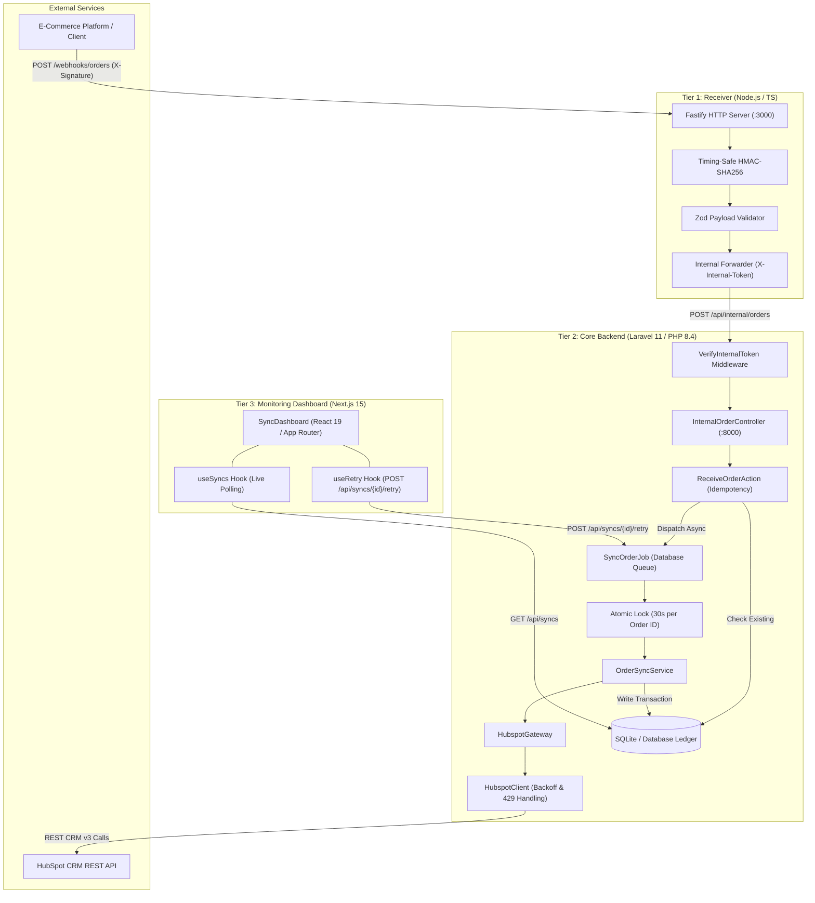

# Order to HubSpot Synchronization System

[](VERSION)
[](https://semver.org)
[](backend/)
[](backend/)
[](receiver/)
[](receiver/)
[](web/)
[](web/)

A high-reliability, 3-tier enterprise integration pipeline designed to ingest order webhooks, verify cryptographic HMAC signatures, deduplicate incoming payloads, synchronize contacts and deals into HubSpot CRM with exponential backoff and rate-limit recovery, and provide real-time visibility through a Next.js operational dashboard.

---

## Table of Contents
- [Architecture Overview](#architecture-overview)
- [System Components & Language Split](#system-components--language-split)
- [Engineering Guidelines & Invariants](#engineering-guidelines--invariants)
  - [1. Strict PascalCase Invariant](#1-strict-pascalcase-invariant)
  - [2. Semantic Versioning Protocol](#2-semantic-versioning-protocol)
  - [3. Remote Protocol (Mandatory SSH)](#3-remote-protocol-mandatory-ssh)
- [Requirement Coverage Matrix](#requirement-coverage-matrix)
- [Getting Started & Setup Guide](#getting-started--setup-guide)
  - [Prerequisites](#prerequisites)
  - [Scaffolding Automation](#scaffolding-automation)
  - [Manual Service Setup](#manual-service-setup)
  - [Docker Compose Quickstart](#docker-compose-quickstart)
- [Security & Idempotency Pipeline](#security--idempotency-pipeline)
  - [HMAC Verification & Timing Attacks](#hmac-verification--timing-attacks)
  - [Two-Tier Deduplication](#two-tier-deduplication)
- [HubSpot CRM Integration & Reliability](#hubspot-crm-integration--reliability)
  - [Deal & Contact Mapping](#deal--contact-mapping)
  - [Rate Limiting & Exception Hierarchy](#rate-limiting--exception-hierarchy)
- [Language B CSV Exporter (Req 28)](#language-b-csv-exporter-req-28)
- [Assumptions & Design Decisions](#assumptions--design-decisions)
- [Production Hardening & Future Improvements](#production-hardening--future-improvements)
- [Release History](#release-history)

---

## Architecture Overview



---

## System Components & Language Split

| Layer | Technology | Primary Responsibilities |
|---|---|---|
| **Tier 1: Ingress Receiver** | Node.js 22, Fastify, Zod, Vitest (Language A) | Ingests webhooks, preserves raw buffer for timing-safe HMAC-SHA256 signature verification, validates payload schema, and forwards to backend. |
| **Tier 2: Processing Core** | PHP 8.4, Laravel 11, SQLite, DB Queue (Language B) | Internal token verification, order deduplication, atomic locking, asynchronous queue dispatch, HubSpot CRM API integration, and audit logging. |
| **Tier 3: Dashboard** | Next.js 15, React 19, TypeScript | Real-time monitoring dashboard, status badge visualization, polling synchronization ledger, and manual attempt retry mutation. |
| **Tooling & Ops** | Docker Compose, n8n, Bash, PowerShell | Multi-container orchestration, low-code fallback workflow, automated infrastructure scaffolding. |

---

## Engineering Guidelines & Invariants

All development in this repository strictly adheres to the invariants codified in [AGENTS.md](AGENTS.md):

### 1. Strict PascalCase Invariant
- **Mandatory PascalCase**: Strictly enforced for all object and type declarations across all languages:
  - **Classes**: `ReceiveOrderAction`, `HubspotClient`, `DealMapper`, `OrderSyncService`, `SyncOrderJob`.
  - **TypeScript Types & Interfaces**: `SyncAttempt`, `OrderPayload`, `CustomerProfile`, `UseSyncsReturn`.
  - **PHP DTOs & Enums**: `OrderData`, `SyncStatus`.
  - **React Components**: `SyncDashboard`, `SyncTable`, `StatusBadge`, `RetryButton`.
- **Strictly Prohibited**: Never use `PascalCase` for everyday variables, function names, properties, or methods (`camelCase` in TypeScript, `camelCase`/`snake_case` in PHP).

### 2. Semantic Versioning Protocol
- Starting Version: `v0.1.0`.
- Format: `vMAJOR.MINOR.PATCH` compliant with SemVer 2.0.0.
- Rules:
  - `PATCH`: Bug fixes, hotfixes, refactors, and documentation updates without contract changes.
  - `MINOR`: New backward-compatible features, endpoints, or schema extensions.
  - `MAJOR`: Breaking changes or incompatible contract overhauls.
- Every release updates [VERSION](VERSION), logs changes in [CHANGELOG.md](CHANGELOG.md), and creates an annotated Git tag `vX.Y.Z`.

### 3. Remote Protocol (Mandatory SSH)
- **Requirement**: Always use SSH URLs for git remotes: `git@github.com:RaymundGerardReyes/Order-Hubspot-Sync.git`.
- **Rationale**: Bypasses Windows Credential Manager HTTPS OAuth token collisions between local accounts, utilizing your machine's pre-authenticated SSH key.

---

## Requirement Coverage Matrix

| Req | Requirement Description | Implementation Files | Status |
|:---:|---|---|:---:|
| **22** | Webhook Receiver, HMAC Verification & Validation | `receiver/src/server.ts`, `hmac.ts`, `schema.ts`, `forward.ts` | **Completed** |
| **23** | HubSpot CRM Sync (Contact, Deal, Association) | `backend/app/Services/Hubspot/*`, `OrderData.php` | **Completed** |
| **24** | Two-Layer Idempotency & Deduplication | `Order.php`, `ReceiveOrderAction.php`, `IdempotencyTest.php` | **Completed** |
| **25** | Reliability, Retry-After & Exception Classification | `HubspotClient.php`, `UpstreamUnavailableException.php`, `UpstreamRejectedException.php` | **Completed** |
| **26** | Audit Storage & State Machine | `SyncAttempt.php`, `SyncStatus.php`, database migrations | **Completed** |
| **27** | Real-Time Monitoring Dashboard & Manual Retries | `SyncAttemptController.php`, `web/src/features/syncs/*` | **Completed** |
| **28** | Language B Export (HubSpot Deals to CSV) | `ExportHubspotDeals.php`, `ExportTest.php` | **Completed** |
| **29** | Complete Documentation, Environment & Mock Tools | `README.md`, `.env.example` | **Completed** |
| **Bonus** | Docker Compose Stack & n8n Low-Code Workflow | `docker-compose.yml`, `n8n/order-to-hubspot.json` | **Completed** |

---

## Getting Started & Setup Guide

### Prerequisites
- **Node.js**: v20.0+ (v22 LTS recommended)
- **PHP**: v8.2+ (v8.4 recommended) with `pdo_sqlite`, `curl`, `mbstring` extensions
- **Composer**: v2.6+
- **Git**: Configured with SSH access to GitHub

---

### Scaffolding Automation

The repository includes idempotent automation scripts to verify or generate the entire 51-file infrastructure hierarchy:

#### Linux / macOS / Git Bash:
```bash
chmod +x scaffold.sh
./scaffold.sh
```

#### Windows PowerShell:
```powershell
powershell -ExecutionPolicy Bypass -File .\scaffold.ps1
```

---

### Manual Service Setup

#### 1. Configuration Setup
Copy the environment template:
```bash
cp .env.example .env
```
Ensure your HubSpot Private App Token is configured in `.env`:
```env
WEBHOOK_SECRET=your_hmac_signing_secret
INTERNAL_TOKEN=internal_shared_secret_bearer_token
HUBSPOT_ACCESS_TOKEN=pat-na1-xxxxxxxx-xxxx-xxxx-xxxx-xxxxxxxxxxxx
HUBSPOT_PIPELINE_ID=default
HUBSPOT_STAGE_ID=closedwon
```

#### 2. Receiver Service (Language A)
```bash
cd receiver
npm install
npm run build
npm start
# Listening on http://localhost:3000
```
Run receiver unit tests:
```bash
npm test
```

#### 3. Core Backend (Language B)
```bash
cd backend
composer install
touch database/database.sqlite
php artisan migrate
php artisan serve
# Listening on http://localhost:8000
```
Start the asynchronous queue worker in a separate terminal:
```bash
php artisan queue:work --tries=3 --timeout=90
```
Run backend tests:
```bash
php artisan test
```

#### 4. Web Dashboard (Next.js)
```bash
cd web
npm install
npm run dev
# Dashboard running at http://localhost:3001 (or :3000)
```

---

### Docker Compose Quickstart

Run the complete multi-service stack with a single command:
```bash
docker compose up -d --build
```
This launches:
- `receiver` on port `3000`
- `backend` on port `8000`
- `worker` running Laravel queue worker
- `web` on port `3001`

---

## Security & Idempotency Pipeline

### HMAC Verification & Timing Attacks
- In incoming webhooks, raw body payloads are intercepted as byte buffers before JSON deserialization to guarantee that byte-level variations do not compromise hash computations.
- Signature comparison in [`receiver/src/hmac.ts`](receiver/src/hmac.ts) utilizes `crypto.timingSafeEqual`, preventing timing-analysis side-channel vulnerabilities.

### Two-Tier Deduplication
1. **Controller / Action Level**: When an order payload arrives, [`ReceiveOrderAction`](backend/app/Actions/ReceiveOrderAction.php) checks if `Order::where('order_id', $orderId)->exists()`. If already processed, it immediately responds with `200 OK (status: duplicate)` and halts re-ingestion.
2. **Worker Queue Level**: When [`SyncOrderJob`](backend/app/Jobs/SyncOrderJob.php) executes, it obtains an atomic cache lock on `order_sync_lock:{orderId}` for 30 seconds. This prevents concurrent workers from synchronizing the same order simultaneously.

---

## HubSpot CRM Integration & Reliability

### Deal & Contact Mapping
Mapping logic in [`DealMapper`](backend/app/Services/Hubspot/DealMapper.php) is isolated and pure:
- Deals are mapped with `dealname`, `amount`, `pipeline`, `dealstage`, and `closedate` formatted strictly as midnight UTC ISO-8601.
- Contacts are extracted by splitting customer names into `firstname` and `lastname` alongside `email`.
- [`HubspotGateway`](backend/app/Services/Hubspot/HubspotGateway.php) performs contact deduplication by querying `crm/v3/objects/contacts/search` prior to creation, avoiding duplicate customer records.
- Associated deals and contacts are linked via HubSpot's association endpoint (`deals/{dealId}/associations/contacts/{contactId}/3`).

### Rate Limiting & Exception Hierarchy
- [`HubspotClient`](backend/app/Services/Hubspot/HubspotClient.php) inspects HTTP response status codes:
  - **429 (Rate Limit)** & **5xx (Server Errors)**: Parses the `Retry-After` header and executes exponential backoff (`2^attempt` seconds), raising an [`UpstreamUnavailableException`](backend/app/Exceptions/UpstreamUnavailableException.php) if all retries are exhausted.
  - **4xx (Client Errors)**: Permanent schema/payload rejections raise [`UpstreamRejectedException`](backend/app/Exceptions/UpstreamRejectedException.php), marking the attempt as permanently failed without wasting queue retries.

---

## Language B CSV Exporter (Req 28)

To satisfy Requirement 28, an Artisan console command exports recent deals from HubSpot directly into a CSV file:

```bash
# Export deals created in the last 7 days to deals_export.csv
php artisan hubspot:export-deals --days=7 --output=deals_export.csv
```

Features:
- Search filter query for `createdate >= {cutoffDate}`.
- Automatic cursor pagination handling via HubSpot's `paging.next.after`.
- Generates standard CSV headers: `Deal ID`, `Order ID`, `Deal Name`, `Amount`, `Stage`, `Close Date`, `Create Date`.

---

## Assumptions & Design Decisions

1. **Lightweight Database Queue**: Used Laravel's database queue driver instead of Redis to ensure zero external infrastructure dependencies for local evaluation while preserving full ACID transaction semantics.
2. **Fastify Over Express**: Fastify was selected for Tier 1 due to native support for raw body parsing buffers and high throughput.
3. **Append-Only Attempts Ledger**: Every sync execution (whether initial or retried) generates a new record in `sync_attempts` with a foreign key pointer `retry_of`, preserving complete historical auditability.

---

## Production Hardening & Future Improvements

- **Webhook Nonce & Replay Prevention**: Introduce a mandatory timestamp window and nonce verification in the HMAC header to guard against replay attacks.
- **Dead Letter Queue (DLQ) Alerting**: Integrate Slack or PagerDuty webhooks when an attempt exhausts maximum retries.
- **Redis Queue Scaling**: Swap database queue for Redis or Amazon SQS when throughput exceeds 500 orders/sec.
- **Prometheus Metrics**: Expose Prometheus endpoints (`/metrics`) measuring attempt latencies, rate limit occurrences, and failure rates.

---

## Release History

See [CHANGELOG.md](CHANGELOG.md) for full historical release notes.

- **`v0.8.2`**: Comprehensive production documentation, architecture specs, and setup instructions.
- **`v0.8.1`**: Remote protocol configuration patch ensuring mandatory SSH usage.
- **`v0.8.0`**: Docker Compose containerization stack, n8n workflow, and environment templates.
- **`v0.7.0`**: Language B HubSpot deals CSV export Artisan command and tests.
- **`v0.6.0`**: Next.js 15 monitoring dashboard, polling hooks, and backend sync APIs.
- **`v0.5.0`**: Fastify HMAC receiver service, Zod validator, and internal ingress controller.
- **`v0.4.0`**: Queue worker, idempotency actions, and feature test suites.
- **`v0.3.0`**: HubSpot CRM client, gateway, mapper, and exception handlers.
- **`v0.2.0`**: Domain models, DTOs, finite state machine, and database migrations.
- **`v0.1.0`**: Initial template infrastructure scaffold and PascalCase governance baseline.