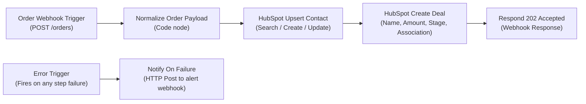

# n8n Workflow Automation: Setup & Execution Guide

This guide explains how to set up, import, and run the bonus n8n workflow for the **Stage 2 Take-Home Integration Project**.

---

## What is n8n?

[n8n](https://n8n.io/) is an open-source, fair-code visual workflow automation platform. Instead of writing backend code for every integration, n8n lets you design complex data pipelines using visual nodes that listen for events, transform payloads, and connect to APIs (like HubSpot).

### Bonus Objective Alignment
* **Requirements 1–3 in n8n**: Webhook ingestion (`POST /webhook/orders`), payload normalization, contact lookup/upsert, deal creation with associations, and HTTP `202 Accepted` response.
* **Error Workflow**: Built-in `Error Trigger` node wired to an HTTP notification node (`Notify On Failure`) that automatically fires whenever an upstream step fails.
* **Exported JSON File**: [`order-to-hubspot.json`](./order-to-hubspot.json).

---

## 1. How to Launch n8n Locally

You have two simple ways to launch n8n on your machine:

### Method A: Using `npx n8n` (No Docker Required — Fast & Direct)
Because Node.js (v20+ or v22) is already installed on your system:

1. Open your terminal (PowerShell, Command Prompt, or Git Bash).
2. Run:
   ```bash
   npx n8n
   ```
3. n8n will start and output:
   ```text
   Editor is now accessible via:
   http://localhost:5678/
   ```

### Method B: Using Docker Compose (Background Service)
Because Docker is already installed and running on your machine:

1. In the repository root, run:
   ```bash
   docker compose up -d n8n
   ```
2. Check that the container is healthy:
   ```bash
   docker ps -f name=order_sync_n8n
   ```
3. n8n is immediately accessible at `http://localhost:5678`.

---

## 2. Initial Setup (First-Time Only)

1. Open your browser and navigate to:  
   **[http://localhost:5678](http://localhost:5678)**
2. On your first launch, n8n displays an account setup screen.
3. Fill in your name, email, and password (this account is purely local to your computer).
4. Click **Set up** to enter the canvas.

---

## 3. How to Import the Workflow

1. In the n8n canvas, click the **Options menu (`...`)** in the top right corner.
2. Select **Import from File**.
3. Browse and select:  
   `D:\New folder (2)\Order-Hubspot-Sync\n8n\order-to-hubspot.json`  
   *(Or simply open the JSON file, copy the entire text, click anywhere on the n8n canvas, and press `Ctrl + V`).*
4. The complete workflow will appear on your canvas:



---

## 4. Connecting Your HubSpot Account

To allow the workflow to create contacts and deals in your HubSpot portal:

1. Double-click the node labeled **HubSpot Upsert Contact**.
2. In the node parameters panel on the right, find **Credential to connect with**.
3. Click the dropdown and select **Create New Credential**.
4. Choose **HubSpot Developer API / Private App Token / Service Key**.
5. Paste your token (the `HUBSPOT_ACCESS_TOKEN` from your `.env` file, e.g. `pat-na2-...`).
6. Click **Save**.
7. Close the credential dialog. n8n will automatically link this credential to both the **HubSpot Upsert Contact** and **HubSpot Create Deal** nodes.

---

## 5. Automated Testing & Logic Proof (`scripts/test-n8n.ts`)

To mathematically and cryptographically prove that the n8n workflow executes the business logic correctly, an automated test harness is provided in [`scripts/test-n8n.ts`](../scripts/test-n8n.ts).

### Running the Automated n8n Test Suite
Make sure the workflow is activated in n8n (or set to listen for events), then run:

```bash
# From receiver/ directory:
npm run test:n8n

# Or directly from root via tsx:
npx tsx scripts/test-n8n.ts --url=http://localhost:5678/webhook/orders
```

### What the Test Suite Proves (5 Automated Checks)
| Test Scenario | Payload Condition | Expected HTTP Status | Expected Behavior |
|---|---|---|---|
| **1. Valid Order Submission** | Canonical Stage 2 payload + Valid HMAC | `HTTP 202 Accepted` | Creates Contact & Deal, links Deal to Contact |
| **2. Cryptographic Tampering** | Corrupted / Forged HMAC signature | `HTTP 401 Unauthorized` | Rejects payload with `{"error": "Unauthorized"}` |
| **3. Mathematical Integrity** | `sum(items.qty * price) !== total` | `HTTP 422 Unprocessable` | Rejects payload with calculation discrepancy notice |
| **4. Idempotency Guard** | Re-dispatch identical `order_id` | `HTTP 200 OK` | Responds with `{"duplicate": true}` without duplicate deals |
| **5. Schema Validation** | Missing `customer.email` or `order_id` | `HTTP 422 Unprocessable` | Rejects invalid payloads before CRM invocation |

---

## 6. Manual Testing via cURL

To manually test the workflow with a valid signed order payload:

```bash
BODY='{"event":"order.created","order_id":"ORD-N8N-101","created_at":"2026-10-05T14:32:00+08:00","customer":{"email":"maria.santos@example.com","first_name":"Maria","last_name":"Santos","phone":"+639171234567"},"items":[{"sku":"TSH-BLK-M","name":"Black Tee (M)","qty":2,"price":450.00}],"currency":"PHP","total":900.00}'
SIG=$(printf "%s" "$BODY" | openssl dgst -sha256 -hmac "stage2_secret_key_super_secure_99" | awk '{print $2}')

curl -X POST "http://localhost:5678/webhook/orders" \
  -H "Content-Type: application/json" \
  -H "X-Webhook-Signature: $SIG" \
  -d "$BODY"
```

---

## 7. How the Error Notification Workflow Works

1. The workflow includes an **Error Trigger** node connected to **Notify On Failure**.
2. If any node fails (e.g. invalid HubSpot token, rate limit, or invalid data):
   * n8n halts the main branch.
   * The **Error Trigger** automatically intercepts the runtime exception.
   * It extracts the `executionId`, `error.message`, and `lastNodeExecuted`.
   * The **Notify On Failure** node dispatches an HTTP POST payload to the notification endpoint configured in `$env.NOTIFICATION_WEBHOOK_URL` (or fallback).
3. This guarantees ops/support teams receive immediate alerts whenever an order sync encounters an unexpected failure.

---

## 8. Frequently Asked Questions & Diagnostics

### Q: Why do startup logs say `Failed to start Python task runner in internal mode`?
```text
Failed to start Python task runner in internal mode. because Python 3 is missing from this system.
Launching a Python runner in internal mode is intended only for debugging and is not recommended for production.
```
* **Status**: Harmless informational notice.
* **Why it appears**: In modern n8n (v2.x), n8n checks at boot for an optional Python 3 environment. The official Alpine base container intentionally does not bundle Python 3 to maintain a lightweight image.
* **Does it affect our order pipeline?**: **No**. The Stage 2 order integration pipeline uses **JavaScript** in the Code node (which registered successfully as `JS Task Runner`). Python is not required, and n8n continues running normally on `http://localhost:5678`.

### Q: Why do logs mention `N8N_RUNNERS_MODE -> Internal task runner mode is deprecated`?
```text
N8N_RUNNERS_MODE -> Internal task runner mode is deprecated and will be removed in a future version. For isolation and scaling, run the task runner launcher as a separate process, set this variable to external...
```
* **Status**: Informational architecture recommendation.
* **Why it appears**: For large-scale multi-tenant production clusters running thousands of workflows concurrently, n8n recommends running external runner sidecar containers (`external` mode).
* **For local development & single-container evaluation**: Single-container `internal` runner mode is standard, fully supported, and requires zero extra sidecars. All JavaScript transformations in our order pipeline execute with zero issues.

### Q: How were the other deprecation warnings addressed?
`docker-compose.yml` explicitly defines:
* `N8N_UNVERIFIED_PACKAGES_ENABLED=true`
* `N8N_RUNNERS_TASK_TIMEOUT=300`
* `N8N_COMPRESSION_NODE_MAX_DECOMPRESSED_SIZE_BYTES=2147483648`
* `N8N_COMPRESSION_NODE_MAX_ZIP_ENTRIES=5000`
This keeps future defaults locked to expected limits and silences startup deprecation notices.

### Q: What is the "Connect a model" / "Google Gemini (PaLM) Api" modal, and is it required?
* **Status**: Optional developer copilot feature.
* **Is it required for this project?**: **No**. The Stage 2 order integration pipeline (`order-to-hubspot.json`) is **100% deterministic code** using standard Node.js crypto and HubSpot CRM nodes. It executes without any AI models or API tokens.
* **If you want to use the AI Assistant for free**:
  * **Option A: Free Google Gemini (Google AI Studio)**:
    - **Host**: `https://generativelanguage.googleapis.com`
    - **API Key**: Obtain a 100% free developer API key from [Google AI Studio](https://aistudio.google.com/) (starts with `AIzaSy...`, zero credit card required, 15 RPM free tier).
    - **Allowed HTTP Request Domains**: Leave empty.
  * **Option B: 100% Open-Source Local (Ollama)**:
    - Install [Ollama](https://ollama.com/) on Windows.
    - Run `ollama run qwen2.5-coder:1.5b`.
    - In n8n, select the Ollama or OpenAI-compatible node with Base URL `http://host.docker.internal:11434/v1`.

### Q: Why did `npm run test:n8n` return `404: The requested webhook "POST orders" is not registered`?
* **Cause**: n8n production webhook endpoints (`/webhook/*`) are only active when the workflow is explicitly turned **Active**.
* **Solution**:
  1. Open n8n at `http://localhost:5678`.
  2. Open the workflow (`Order to HubSpot Sync with Full Validation`).
  3. In the top-right corner of the canvas, switch the **Active** toggle to **ON** (green).
  4. Save the workflow (`Ctrl + S`).
  5. Re-run `npm run test:n8n`.

