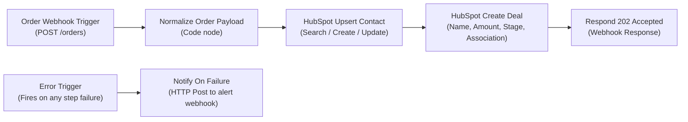

# n8n Workflow Automation: Setup & Execution Guide

This guide explains how to set up, import, and run the bonus n8n workflow for the **Stage 2 Take-Home Integration Project**.

---

## What is n8n?

[n8n](https://n8n.io/) is an open-source, fair-code visual workflow automation platform. Instead of writing backend code for every integration, n8n lets you design complex data pipelines using visual nodes that listen for events, transform payloads, and connect to APIs (like HubSpot).

### Bonus Objective Alignment
* **Requirements 1–3 in n8n**: Webhook ingestion (`POST /webhook/orders`), payload normalization, contact lookup/upsert, deal creation with associations, and HTTP `202 Accepted` response.
* **Error Workflow**: Built-in `Error Trigger` node wired to an HTTP notification node (`Notify On Failure`) that automatically fires whenever an upstream step fails.
* **Exported JSON File**: [`order-to-hubspot.json`](./order-to-hubspot.json).

---

## 1. How to Launch n8n Locally

You have two simple ways to launch n8n on your machine:

### Method A: Using `npx n8n` (No Docker Required — Fast & Direct)
Because Node.js (v20+ or v22) is already installed on your system:

1. Open your terminal (PowerShell, Command Prompt, or Git Bash).
2. Run:
   ```bash
   npx n8n
   ```
3. n8n will start and output:
   ```text
   Editor is now accessible via:
   http://localhost:5678/
   ```

### Method B: Using Docker Compose (Background Service)
Because Docker is already installed and running on your machine:

1. In the repository root, run:
   ```bash
   docker compose up -d n8n
   ```
2. Check that the container is healthy:
   ```bash
   docker ps -f name=order_sync_n8n
   ```
3. n8n is immediately accessible at `http://localhost:5678`.

---

## 2. Initial Setup (First-Time Only)

1. Open your browser and navigate to:  
   **[http://localhost:5678](http://localhost:5678)**
2. On your first launch, n8n displays an account setup screen.
3. Fill in your name, email, and password (this account is purely local to your computer).
4. Click **Set up** to enter the canvas.

---

## 3. How to Import the Workflow

1. In the n8n canvas, click the **Options menu (`...`)** in the top right corner.
2. Select **Import from File**.
3. Browse and select:  
   `D:\New folder (2)\Order-Hubspot-Sync\n8n\order-to-hubspot.json`  
   *(Or simply open the JSON file, copy the entire text, click anywhere on the n8n canvas, and press `Ctrl + V`).*
4. The complete workflow will appear on your canvas:



---

## 4. Connecting Your HubSpot Account

To allow the workflow to create contacts and deals in your HubSpot portal:

1. Double-click the node labeled **HubSpot Upsert Contact**.
2. In the node parameters panel on the right, find **Credential to connect with**.
3. Click the dropdown and select **Create New Credential**.
4. Choose **HubSpot Developer API / Private App Token / Service Key**.
5. Paste your token (the `HUBSPOT_ACCESS_TOKEN` from your `.env` file, e.g. `pat-na2-...`).
6. Click **Save**.
7. Close the credential dialog. n8n will automatically link this credential to both the **HubSpot Upsert Contact** and **HubSpot Create Deal** nodes.

---

## 5. Testing the Workflow

1. In n8n, double-click the **Order Webhook Trigger** node.
2. Click the **Listen for test event** button.
   * n8n will activate and display the test webhook URL:
     `http://localhost:5678/webhook-test/orders`
3. In your terminal, send a sample order payload:

```bash
curl -X POST "http://localhost:5678/webhook-test/orders" \
  -H "Content-Type: application/json" \
  -d '{"event":"order.created","order_id":"ORD-N8N-101","created_at":"2026-10-03T14:32:00+08:00","customer":{"email":"maria.santos@example.com","first_name":"Maria","last_name":"Santos","phone":"+639171234567"},"items":[{"sku":"TSH-BLK-M","name":"Black Tee (M)","qty":2,"price":450.00}],"currency":"PHP","total":900.00}'
```

4. Look at the n8n canvas:
   * **Order Webhook Trigger** turns green and receives the payload.
   * **Normalize Order Payload** normalizes names, phone, and timestamps.
   * **HubSpot Upsert Contact** updates or creates the contact in HubSpot.
   * **HubSpot Create Deal** creates the deal and links it to the contact.
   * **Respond 202 Accepted** returns HTTP `202 Accepted` to the client.

---

## 6. How the Error Notification Workflow Works

1. The workflow includes an **Error Trigger** node connected to **Notify On Failure**.
2. If any node fails (e.g. invalid HubSpot token, rate limit, or invalid data):
   * n8n halts the main branch.
   * The **Error Trigger** automatically intercepts the runtime exception.
   * It extracts the `executionId`, `error.message`, and `lastNodeExecuted`.
   * The **Notify On Failure** node dispatches an HTTP POST payload to the notification endpoint configured in `$env.NOTIFICATION_WEBHOOK_URL` (or fallback).
3. This guarantees ops/support teams receive immediate alerts whenever an order sync encounters an unexpected failure.

---

## 7. Frequently Asked Questions & Diagnostics

### Q: Why do startup logs say `Failed to start Python task runner in internal mode`?
```text
Failed to start Python task runner in internal mode. because Python 3 is missing from this system.
Launching a Python runner in internal mode is intended only for debugging and is not recommended for production.
```
* **Status**: Harmless informational notice.
* **Why it appears**: In modern n8n (v2.x), n8n checks at boot for an optional Python 3 environment. The official Alpine base container intentionally does not bundle Python 3 to maintain a lightweight image.
* **Does it affect our order pipeline?**: **No**. The Stage 2 order integration pipeline uses **JavaScript** in the Code node (which registered successfully as `JS Task Runner`). Python is not required, and n8n continues running normally on `http://localhost:5678`.
